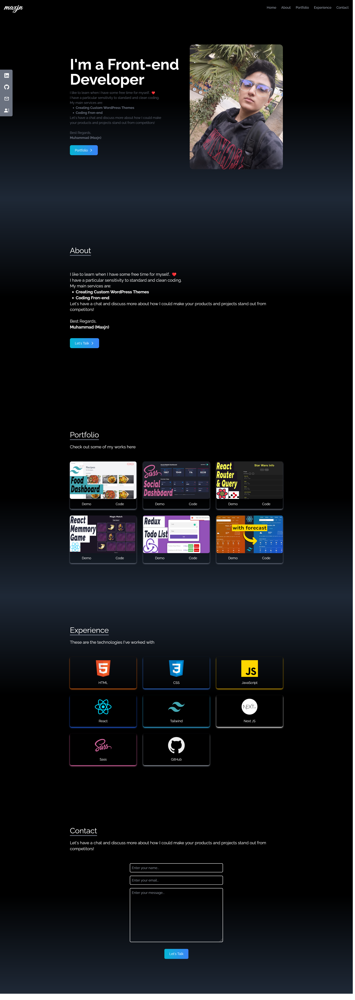

# Portfolio -React

This is a simple portfolio application for practicing React & Tailwind.

See [Live Project](https://maxjn-portfolio-two.pages.dev/).
This Project was bootstrapped with [Vite](https://vitejs.dev/).

## Technologies

- HTML,Tailwind
- ES6
- React
- **react-icons** package for icons
- **ract-smooth-scroll**

## Features

- Mobile Firs
- Responsive

## Installation

Install **Portfolio-two** with npm

```shell
npm install

npm run dev
```

## Screenshots


